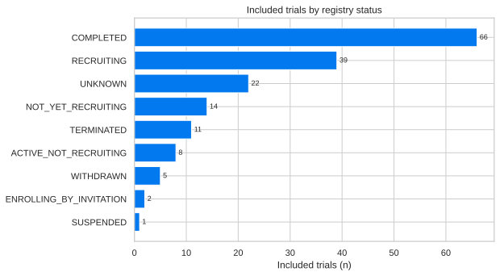
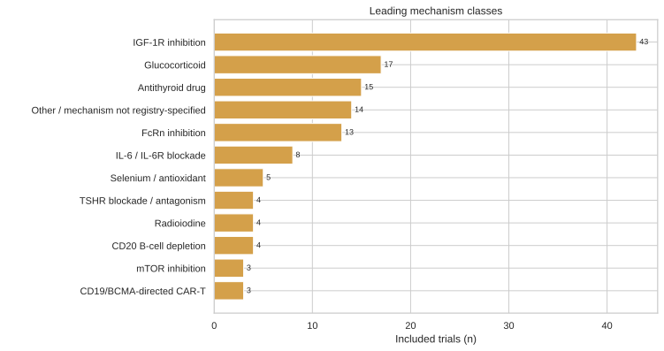
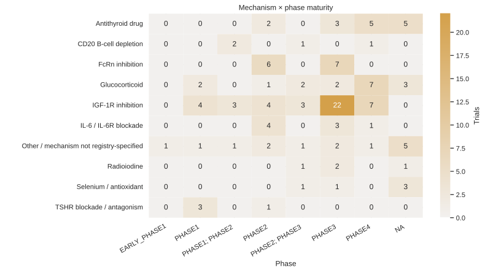
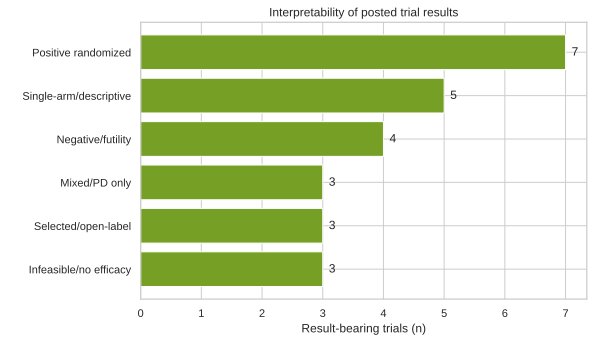
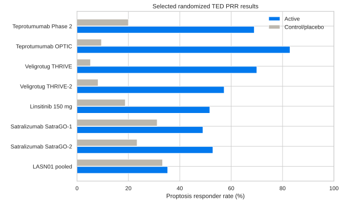
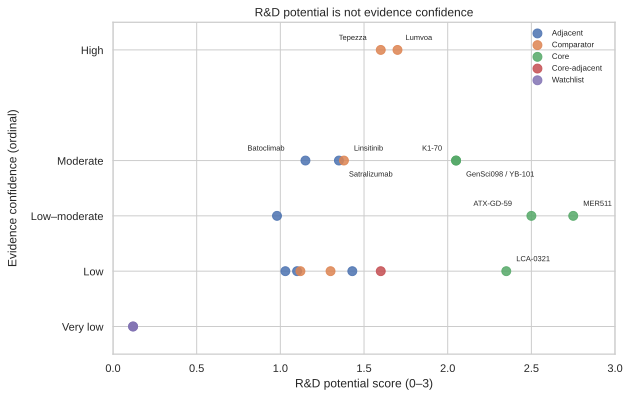

# Graves’ disease 및 thyroid eye disease 치료·R&D landscape

**Data cut:** 2026-09-10  
**범위:** 미국, EU/EEA, 영국, 대한민국, 일본; 성인 중심, 소아·임신/수유·고령·재발/불응군 분리  
**분석 원칙:** cross-trial pooling 또는 quantitative meta-analysis를 수행하지 않았으며, R&D potential과 evidence confidence를 분리했다.

## Executive summary

1. **임상 landscape.** 동일 query와 status 범위의 ClinicalTrials.gov frozen cut에는 324개 record가 있었고, 193개를 audit triage하여 168개를 포함했다. 25개 포함 trial에 posted results가 있었으며, snapshot 간 ID·tracked-field drift는 0건이었다.
2. **TED의 가장 강한 efficacy evidence는 IGF-1R class에 집중**되어 있다. Teprotumumab과 veligrotug randomized trials는 proptosis response에서 큰 placebo 차이를 보였고, chronic TED에도 signal이 확인됐다. 다만 class-related hearing, glycemic, muscle-spasm 및 reproductive-event monitoring이 필요하다.
3. **Lumvoa는 2026-06-26 FDA 승인**을 받았으며, label indication은 TED activity 또는 duration과 무관하고 권장 용법은 10 mg/kg IV Q3W ×5이다 [373, 726, 727]. 따라서 2026-09-10 시점 미국 TED 시장은 Tepezza 단독 승인 환경이 아니다.
4. **Disease-driver 전략은 아직 efficacy proof 이전이다.** LCA-0321과 MER511은 anti-TSHR autoantibody를 직접 제거하려는 가장 정밀한 접근이지만 human efficacy, normal TSH physiology 보존, 면역원성, 실제 off-treatment durability는 미확정이다.
5. **“Control”, “remission”, “cure”를 구분해야 한다.** ATD 복용 중 hormone normalization, ATD 중단 시점의 normalization, 장기 off-treatment remission, RAI/수술에 의한 hormone-source 제거는 서로 다른 outcome이다. 현재 어떤 direct anti-TSHR asset도 durable cure를 입증하지 않았다.

## 1. Methods 및 audit boundary

- 질환·동의어 query, 전체 registry status, disease-directed treatment scope를 고정했다.
- 모든 included record는 status와 why-stopped를 보존했다. 포함 status 분포: COMPLETED 66, RECRUITING 39, UNKNOWN 22, NOT_YET_RECRUITING 14, TERMINATED 11, ACTIVE_NOT_RECRUITING 8, WITHDRAWN 5, ENROLLING_BY_INVITATION 2, SUSPENDED 1.
- 25개 result-bearing trial은 primary interpretation, secondary efficacy, safety, durability, publication linkage 및 caveat를 별도 canonical curation으로 저장했다.
- 비교는 각 trial의 randomized comparator 안에서만 수행했다. 서로 다른 trial의 percent 또는 mean change를 직접 합치지 않았다.
- Textual QA는 동일 agent의 stance-blinded second pass이며 독립 제3자 검증이 아니다.

## 2. Disease and endpoint framework

### 2.1 GD hyperthyroidism

- **Biochemical control:** ATD 또는 investigational therapy를 복용하면서 FT4/FT3가 정상화된 상태.
- **ATD-sparing response:** ATD 증량 없이 normalization 또는 ATD dose 감소.
- **Off-ATD normalization:** 특정 시점에 ATD 없이 FT3/FT4가 정상인 상태. 추적 기간이 짧으면 remission으로 부르지 않는다.
- **Durable off-treatment remission:** 사전 정의된 충분한 추적 기간 동안 therapy 없이 euthyroidism이 지속되고 relapse가 없는 상태.
- **Ablative/surgical control:** RAI 또는 thyroidectomy로 hyperthyroidism source를 제거한 상태. 면역학적 autoimmunity 또는 TED까지 제거했다는 뜻이 아니다.
- **Cure:** 정상 thyroid function, pathogenic autoimmunity의 지속적 소실, 무치료 durability를 모두 요구하는 강한 표현이다. 현재 임상적으로 입증되지 않았다.

### 2.2 TED

TED trial의 주요 endpoint는 PRR(일반적으로 ≥2 mm proptosis reduction), CAS, diplopia response, overall response, GO-QOL 및 imaging이다. 이 endpoint들은 GD biochemical remission과 교환 가능하지 않다.

## 3. Standard of care

ATD, RAI, total thyroidectomy는 GD hyperthyroidism의 핵심 옵션이다 [39]. RAI와 수술은 “definitive”한 hormone control을 제공할 수 있지만, 이는 immune cure와 구별해야 한다. 대한민국 RAI practice는 2025 Korean Thyroid Association guideline을 별도 반영했다 [28]. Active moderate-to-severe TED에서 EU guidance는 IV glucocorticoid-based therapy를 중심으로 하고 [135], ATA/ETA consensus는 phenotype, activity, severity, access에 따라 biologic, radiation, decompression/rehabilitative surgery를 배치한다 [139].

Regional reimbursement, formulary 및 실제 접근성은 공개 source의 시점 차이가 커서 label approval과 동일시하지 않았다. 대한민국에서는 이 review pass에서 definitive official teprotumumab authorization/reimbursement record를 확인하지 못했으므로 “미승인”으로 단정하지 않고 **unresolved**로 표기했다.

## 4. Clinical-trial landscape

총 168개 포함 trial 중 25개가 posted results를 보유했다. 결과의 해석가능성은 단순 positive/negative 이분법보다 중요하다.

### 4.1 Negative 및 stopped evidence

- Rituximab randomized active-TED trial NCT00595335는 CAS와 failure rate에서 negative였다.
- Secukinumab NCT04737330은 futility로 종료되고 Week 16 PRR/overall response가 0이었다.
- Celecoxib NCT02845336은 poor enrollment로 종료되어 infeasibility이지 efficacy failure가 아니다.
- ASCEND GO-2는 clinical primary comparisons가 nonsignificant였지만 IgG/anti-TSHR PD를 보였고, premature unblinding의 맥락을 보존해야 한다.
- SatraGO-1은 primary endpoint를 놓쳤고 SatraGO-2는 충족했다 [699, 701].

## 5. TED efficacy and safety

### 5.1 IGF-1R class

- Teprotumumab Phase 2와 OPTIC은 active TED에서 large PRR/composite-response effects를 보였다. OPTIC PRR은 82.9% 대 9.5%였다.
- Chronic/low-activity teprotumumab trial에서 Week 24 proptosis difference는 −1.48 mm였다 [190].
- Veligrotug THRIVE Week 15 PRR은 70.0% 대 5.26%였고, initial responders 중 follow-up 가능한 subset의 70%가 Week 52 response를 유지했다 [230, 713].
- THRIVE-2 chronic TED PRR은 57.28% 대 8.22%였으나 Week 15 이후 efficacy durability는 registry에 게시되지 않았다.
- Linsitinib high dose는 PRR 51.7% 대 18.8%로 positive였지만 low dose는 nonsignificant였고 분석은 one-sided alpha 2.5%를 사용했다 [714, 715].

### 5.2 Safety

Teprotumumab/veligrotug class에서는 muscle spasms, hearing-related events, hyperglycemia, infusion reactions가 반복 관찰됐다. Lumvoa label은 infusion reactions, IBD, hyperglycemia와 potentially permanent hearing impairment를 경고한다 [373]. THRIVE-2 registry의 one death는 cause와 relatedness가 기재되지 않아 drug-related death로 해석하지 않았다. Satralizumab SatraGO-2에서는 ALT/AST 및 neutrophil decrease imbalance가 관찰됐다. Linsitinib high dose에서는 diarrhea, nausea, fatigue, transaminase increase가 더 흔했다.

## 6. GD-directed and humoral-axis clinical evidence

- **ATX-GD-59:** TBII/TSAb와 thyroid hormones 개선 신호 및 2명의 one-year off-ATD euthyroidism이 있었지만 uncontrolled Phase 1이므로 spontaneous remission을 배제할 수 없다 [253].
- **Iscalimab:** 13 evaluable subjects 중 Week 12 TSH normalization 0%.
- **Batoclimab GD:** Week 24 off-ATD FT3/FT4 normalization 31.3%였으나 single-arm, background-ATD design이므로 durable remission 또는 cure가 아니다.
- **FcRn TED:** strong total-IgG PD가 clinical efficacy로 일관되게 전환되지 않았다.

## 7. Direct TSHR/anti-TSHR pipeline

### 7.1 LCA-0321

LCA-0321은 disease-causing anti-TSHR autoantibodies에 결합해 lysosomal degradation을 유도하도록 설계된 LYTAC이며, general immunosuppression 없이 driver를 제거한다는 가설을 가진다 [1]. CTIS 2025-524053-14-00/LCA-0321-01은 ongoing recruiting Phase 1 SAD/MAD, planned n=48이다. 강점은 높은 antigen specificity와 직접적 PD 측정 가능성이다. 핵심 위험은 first-in-human safety, immunogenicity, autoantibody rebound, antibody heterogeneity, tissue-level TED response와 biochemical response의 연결이다.

### 7.2 MER511

MER511은 TSHR ectodomain–mutant Fc fusion으로 anti-TSHR autoantibodies를 neutralize/clear하고 FcγRIIB를 통해 degradation을 유도하며 antigen-specific B-cell function도 억제하도록 설계됐다 [6, 8]. NEXUS NCT07305818은 adult GD에서 IV/SC SAD/MAD Phase 1이다. 정상 TSH signaling을 보존한다는 preclinical claim은 중요한 differentiation이지만 아직 사람에서 검증되지 않았다. Lilly acquisition은 발표됐으나 closing을 입증하는 Lilly/SEC primary record를 찾지 못해 cutoff ownership에 uncertainty를 남겼다.

### 7.3 Other direct approaches

- GenSci098/YB-101: direct TSHR antagonism, 다수 Phase 1/2 records.
- K1-70: blocking monoclonal autoantibody; early clinical and Japanese Phase 1 evidence [164].
- ATX-GD-59/WP1302: antigen-specific tolerance; follow-on WP1302는 suitable-subject recruitment infeasibility로 suspended.
- IBI3031: dual IGF-1R/TSHR blockade; target-balance와 systemic thyroid signaling을 관찰해야 한다.

## 8. R&D potential vs evidence confidence

R&D potential score는 driver proximity 30%, potential durability 25%, selectivity 20%, translational/PD tractability 15%, developability 10%로 계산했다. 이는 투자 또는 임상 성공 확률이 아니며 evidence confidence와 별도 축이다.

- **MER511:** 가장 높은 hypothesis-based potential. Autoantibody clearance와 source suppression을 함께 겨냥하지만 human proof가 없다.
- **LCA-0321:** antigen-specific clearance가 명확하고 PD가 tractable하지만 source suppression/durability는 불명확하다.
- **ATX-GD-59:** tolerance의 durability upside가 있으나 작은 uncontrolled signal뿐이다.
- **Approved IGF-1R agents:** TED efficacy confidence는 높지만 GD autoimmunity cure potential은 낮다.

## 9. Special populations

- **Pediatrics:** ATD duration과 definitive treatment의 risk-benefit가 성인과 다르다. NCT01269749는 posted efficacy가 없어 RAI efficacy를 추론하지 않았다.
- **Pregnancy/lactation:** RAI 금기, ATD 선택과 trimester timing, surgery timing을 별도 관리해야 한다. Investigational biologics는 임신 데이터가 제한적이다.
- **Older adults:** cardiovascular, glycemic, hearing, surgical 및 steroid toxicity가 treatment choice를 바꾼다.
- **Relapsed/refractory:** open-label retreatment/feeder studies는 selection bias가 커 randomized evidence와 분리했다.

## 10. Limitations

1. Registry-based landscape는 미등록 preclinical assets와 비공개 failures를 놓칠 수 있다.
2. 일부 2026 congress/sponsor results는 peer-reviewed full paper가 없다.
3. Regional authorization/reimbursement는 공식 portal의 searchability와 업데이트 지연 때문에 unresolved fields가 남는다.
4. 결과가 게시된 trial만 깊게 수치화했으며, no-result trial에는 efficacy 없음이 아니라 **public evidence 없음**으로 기록했다.
5. Within-agent blinded QA는 first-pass bias를 줄이지만 독립 validation이 아니다.

## 11. Conclusions

현재 TED에서는 IGF-1R pathway가 가장 성숙한 clinical efficacy와 미국 regulatory validation을 보유한다. 반면 GD의 근본적 disease modification과 durable off-treatment remission은 여전히 큰 unmet need다. LCA-0321과 MER511은 pathogenic anti-TSHR antibodies를 정밀하게 제거하는 가장 직접적인 strategy이지만, human efficacy와 durability가 나올 때까지 높은 R&D potential을 높은 evidence confidence로 오인하면 안 된다. Near-term decision points는 (i) Phase 1 safety/PK/PD와 TRAb kinetics, (ii) ATD taper를 내장한 durable off-treatment endpoints, (iii) normal TSH signaling/total IgG preservation, (iv) TED와 thyroid biochemical benefit의 concordance이다.
